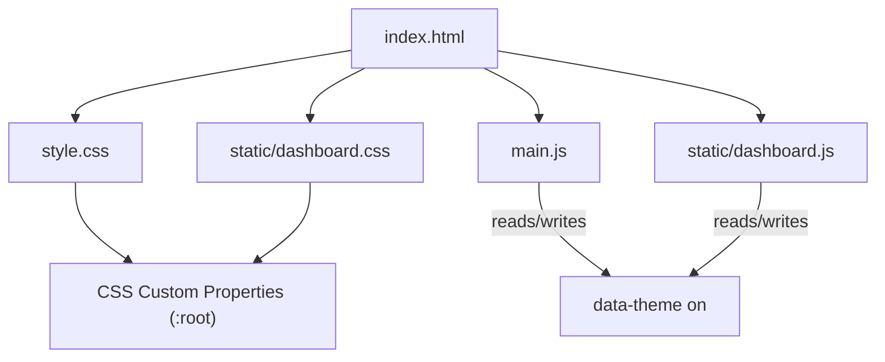
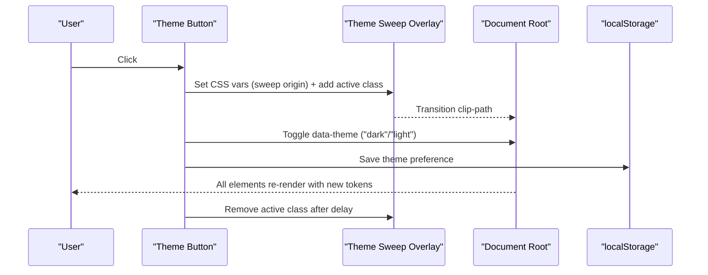
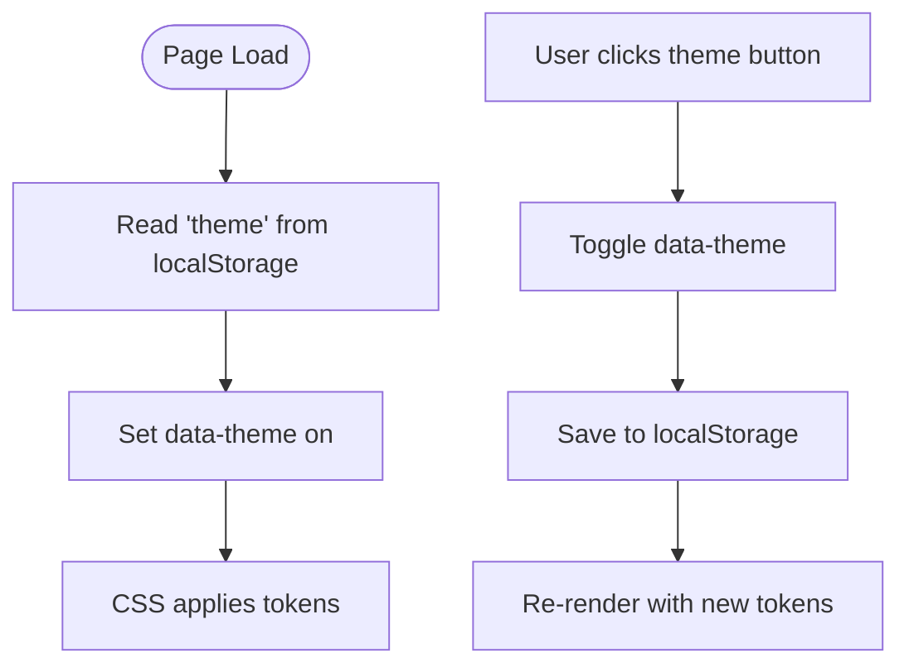
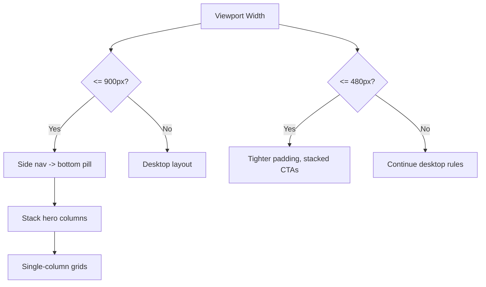
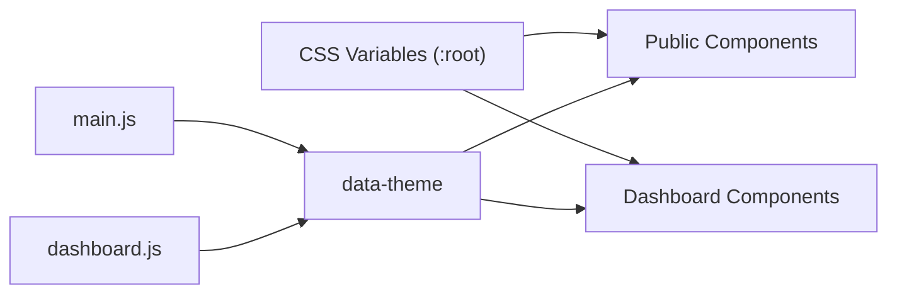

# Styling and Theming

<cite>
**Referenced Files in This Document**
- [index.html](file://index.html)
- [style.css](file://style.css)
- [main.js](file://main.js)
- [static/dashboard.css](file://static/dashboard.css)
- [static/dashboard.js](file://static/dashboard.js)
</cite>

## Table of Contents
1. [Introduction](#introduction)
2. [Project Structure](#project-structure)
3. [Core Components](#core-components)
4. [Architecture Overview](#architecture-overview)
5. [Detailed Component Analysis](#detailed-component-analysis)
6. [Dependency Analysis](#dependency-analysis)
7. [Performance Considerations](#performance-considerations)
8. [Troubleshooting Guide](#troubleshooting-guide)
9. [Conclusion](#conclusion)
10. [Appendices](#appendices)

## Introduction
This document explains the styling and theming system used across the portfolio site and the admin dashboard. It covers design tokens, color schemes, typography, spacing, component patterns, dark/light theme switching via CSS custom properties and JavaScript, responsive strategies, accessibility considerations, and guidance for extending the theme consistently.

## Project Structure
The styling is split between two cohesive stylesheets:
- Public portfolio styles: style.css
- Admin dashboard styles: static/dashboard.css

JavaScript behavior lives in:
- main.js (portfolio interactions, theme toggle, content injection)
- static/dashboard.js (dashboard theme toggle, sidebar, toasts, search)

HTML entry point index.html wires up fonts, preloads theme, and includes both stylesheets and scripts.

**Diagram sources**
- [index.html:1-55](file://index.html#L1-L55)
- [style.css:8-56](file://style.css#L8-L56)
- [static/dashboard.css:6-54](file://static/dashboard.css#L6-L54)
- [main.js:140-162](file://main.js#L140-L162)
- [static/dashboard.js:25-35](file://static/dashboard.js#L25-L35)

**Section sources**
- [index.html:1-55](file://index.html#L1-L55)
- [style.css:8-56](file://style.css#L8-L56)
- [static/dashboard.css:6-54](file://static/dashboard.css#L6-L54)
- [main.js:140-162](file://main.js#L140-L162)
- [static/dashboard.js:25-35](file://static/dashboard.js#L25-L35)

## Core Components
- Design tokens: Centralized in :root with dark defaults and a light override using data-theme="light". Both stylesheets share identical token names for colors, shadows, radii, fonts, and transitions.
- Theme toggle: A button triggers a sweep animation and flips data-theme on the root element; preference is persisted in localStorage.
- Shared components: Cards, buttons, forms, modals, and toasts use consistent tokens so the public site and dashboard look unified.
- Responsive layout: Mobile-first media queries adjust navigation, grids, and typography.

Key token categories:
- Colors: background, panel, borders, text, accent palette (blue, violet, cyan, emerald, amber, red, magenta), gradients
- Shadows: large, medium, glow
- Radii: base, small, extra-small
- Typography: display, body, mono font families
- Transitions: theme transition timing function

**Section sources**
- [style.css:8-56](file://style.css#L8-L56)
- [static/dashboard.css:6-54](file://static/dashboard.css#L6-L54)

## Architecture Overview
Theme switching flow uses a shared attribute on the root element and CSS variables to re-skin the entire UI instantly. The public site and dashboard maintain synchronized themes by reading/writing the same localStorage key.

**Diagram sources**
- [main.js:140-162](file://main.js#L140-L162)
- [style.css:295-307](file://style.css#L295-L307)
- [index.html:43-51](file://index.html#L43-L51)
- [static/dashboard.js:25-35](file://static/dashboard.js#L25-L35)

## Detailed Component Analysis

### Design Tokens and Color System
- Dark theme defines deep backgrounds, subtle borders, and vibrant accents. Light theme swaps to light backgrounds and adjusted shadow/glow values while keeping the same semantic token names.
- Accent gradient is reused for headings, primary buttons, and highlights to create visual continuity.

Token usage examples:
- Backgrounds and panels: --bg, --bg-alt, --panel, --panel-2, --panel-glass
- Borders and focus: --border, --border-strong
- Text hierarchy: --text, --text-muted, --text-dim
- Accents: --blue, --violet, --cyan, --emerald, --amber, --red, --magenta
- Gradients and shadows: --grad-primary, --shadow-lg, --shadow-md, --shadow-glow
- Spacing and shape: --radius, --radius-sm, --radius-xs
- Typography: --font-display, --font-body, --font-mono
- Motion: --transition-theme

**Section sources**
- [style.css:8-56](file://style.css#L8-L56)
- [static/dashboard.css:6-54](file://static/dashboard.css#L6-L54)

### Typography Standards
- Display font for headings and brand marks
- Body font for readable content
- Monospace for labels, tags, and metadata
- Fluid sizing via clamp() for section titles and hero name

Accessibility:
- Focus-visible outlines are defined using accent color for keyboard users
- Selection color uses the accent blue

**Section sources**
- [style.css:106-133](file://style.css#L106-L133)
- [style.css:512-522](file://style.css#L512-L522)
- [style.css:616-625](file://style.css#L616-L625)

### Spacing Conventions
- Consistent card padding and gaps
- Section vertical rhythm with generous top/bottom padding
- Grid gaps tuned for readability at various screen sizes
- Touch-friendly tap targets for buttons and nav items

**Section sources**
- [style.css:487-528](file://style.css#L487-L528)
- [style.css:661-717](file://style.css#L661-L717)
- [style.css:1128-1162](file://style.css#L1128-L1162)

### Component Styling Patterns
- Glass surfaces: translucent panels with backdrop blur and subtle borders
- Card surfaces: shared base classes for about, timeline, certificates, skills, projects, achievements, services, resume preview, contact form
- Buttons: primary, secondary, outline variants with hover lift and shadow
- Forms: inputs styled with tokens, focus rings, and error states
- Modals: overlay with backdrop blur, animated entrance, sticky close button
- Toasts: slide-in notifications with type-based left border colors

**Section sources**
- [style.css:530-548](file://style.css#L530-L548)
- [style.css:661-717](file://style.css#L661-L717)
- [style.css:1625-1669](file://style.css#L1625-L1669)
- [style.css:1761-1905](file://style.css#L1761-L1905)
- [style.css:1907-1982](file://style.css#L1907-L1982)

### Dark/Light Theme Implementation
- Theme state stored in data-theme on the root element
- CSS overrides in [data-theme="light"] switch token values
- JavaScript toggles theme with a sweep animation and persists choice to localStorage
- Pre-paint script sets initial theme from storage to avoid flash

**Diagram sources**
- [index.html:43-51](file://index.html#L43-L51)
- [main.js:140-162](file://main.js#L140-L162)
- [static/dashboard.js:25-35](file://static/dashboard.js#L25-L35)
- [style.css:42-56](file://style.css#L42-L56)
- [static/dashboard.css:40-54](file://static/dashboard.css#L40-L54)

**Section sources**
- [index.html:43-51](file://index.html#L43-L51)
- [main.js:140-162](file://main.js#L140-L162)
- [static/dashboard.js:25-35](file://static/dashboard.js#L25-L35)
- [style.css:42-56](file://style.css#L42-L56)
- [static/dashboard.css:40-54](file://static/dashboard.css#L40-L54)

### Responsive Design Approach
- Mobile-first breakpoints:
  - 900px: side navigation becomes a bottom pill bar; hero stacks vertically; grids collapse to single column; toast container spans full width
  - 480px: tighter container padding; full-width CTAs; smaller profile image
- Flexible layouts:
  - CSS Grid with auto-fit/minmax for cards and metrics
  - Clamp-based fluid typography for headings
- Adaptive components:
  - Navigation collapses into a compact pill
  - Hero content reorders for mobile
  - Modal and toast containers adapt to narrow screens

**Diagram sources**
- [style.css:1987-2053](file://style.css#L1987-L2053)

**Section sources**
- [style.css:1987-2053](file://style.css#L1987-L2053)

### Accessibility Compliance in Styling
- Keyboard focus visible via :focus-visible with accent color
- Reduced motion support via prefers-reduced-motion to minimize animations
- Semantic HTML structure with proper heading hierarchy
- Images have alt attributes; links open safely with rel="noopener" where applicable

**Section sources**
- [style.css:129-133](file://style.css#L129-L133)
- [style.css:2055-2062](file://style.css#L2055-L2062)
- [index.html:139-140](file://index.html#L139-L140)

### Extending the Theme System
To add a new color or variant:
- Add a new CSS variable under :root (e.g., --accent-secondary)
- Provide a matching value in the [data-theme="light"] block
- Use the variable in components instead of hard-coded colors
- For new component variants, extend existing base classes and reuse tokens

Guidelines:
- Keep token names semantic (e.g., --color-success, --color-warning)
- Maintain contrast ratios in both themes
- Prefer tokens over direct color values to ensure consistency

**Section sources**
- [style.css:8-56](file://style.css#L8-L56)
- [static/dashboard.css:6-54](file://static/dashboard.css#L6-L54)

### Cross-Browser Compatibility
- Backdrop blur uses vendor-prefixed fallbacks for older WebKit browsers
- Scrollbar styling targets WebKit; non-WebKit browsers fall back gracefully
- Gradient text uses standard and prefixed properties

**Section sources**
- [style.css:327-328](file://style.css#L327-L328)
- [style.css:90-93](file://style.css#L90-L93)
- [style.css:517-521](file://style.css#L517-L521)

### Performance Considerations
- CSS minification recommended for production to reduce payload size
- Animations are GPU-friendly (transforms, opacity)
- IntersectionObserver used for scroll reveals and counters to avoid heavy scroll listeners
- Lazy loading images where appropriate

[No sources needed since this section provides general guidance]

## Dependency Analysis
Styles depend on tokens defined in :root. JavaScript depends on DOM nodes and persists theme state. The public site and dashboard share the same theme strategy but live in separate files.

**Diagram sources**
- [style.css:8-56](file://style.css#L8-L56)
- [static/dashboard.css:6-54](file://static/dashboard.css#L6-L54)
- [main.js:140-162](file://main.js#L140-L162)
- [static/dashboard.js:25-35](file://static/dashboard.js#L25-L35)

**Section sources**
- [style.css:8-56](file://style.css#L8-L56)
- [static/dashboard.css:6-54](file://static/dashboard.css#L6-L54)
- [main.js:140-162](file://main.js#L140-L162)
- [static/dashboard.js:25-35](file://static/dashboard.js#L25-L35)

## Performance Considerations
- Minify CSS/JS in production builds
- Defer non-critical scripts if needed
- Avoid excessive animations on low-power devices; rely on prefers-reduced-motion
- Use efficient selectors and avoid deep nesting to keep cascade fast

[No sources needed since this section provides general guidance]

## Troubleshooting Guide
Common issues and fixes:
- Theme not persisting: Ensure localStorage is available and not blocked; verify data-theme is set before first paint
- Flash of wrong theme: Confirm pre-paint script runs before styles load
- Animations too intense: Check prefers-reduced-motion and disable heavy effects
- Form focus ring missing: Verify :focus-visible styles are applied and not overridden

**Section sources**
- [index.html:43-51](file://index.html#L43-L51)
- [main.js:140-162](file://main.js#L140-L162)
- [static/dashboard.js:25-35](file://static/dashboard.js#L25-L35)
- [style.css:2055-2062](file://style.css#L2055-L2062)

## Conclusion
The styling system is built around a robust token layer that powers consistent dark/light themes across the portfolio and dashboard. JavaScript manages theme state with smooth transitions and persistence. Responsive design ensures usability across devices, while accessibility and performance practices keep the experience inclusive and efficient. Extend the system by adding tokens and reusing them throughout components to maintain design consistency.

## Appendices

### Quick Reference: Key Classes and Tokens
- Theme toggle: #theme-toggle (public), .db-theme-toggle (dashboard)
- Sweep overlay: .theme-sweep
- Base tokens: --bg, --panel, --text, --border, --grad-primary, --shadow-md, --radius
- Common components: .btn, .card-like surfaces, .modal-overlay, .toast-container

**Section sources**
- [index.html:98-101](file://index.html#L98-L101)
- [style.css:295-307](file://style.css#L295-L307)
- [style.css:661-717](file://style.css#L661-L717)
- [style.css:1761-1982](file://style.css#L1761-L1982)
- [static/dashboard.css:450-452](file://static/dashboard.css#L450-L452)