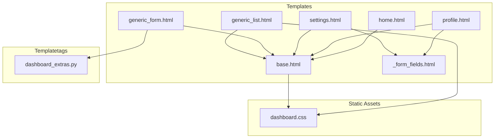
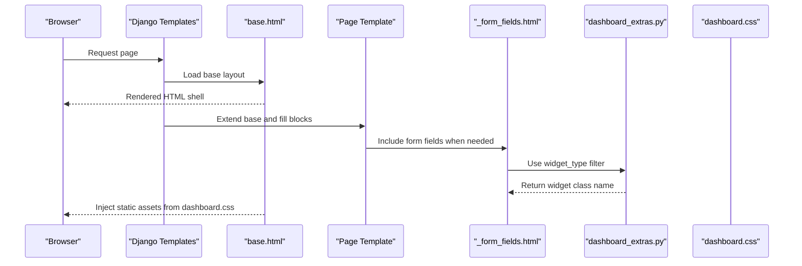
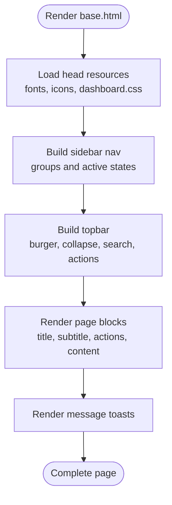
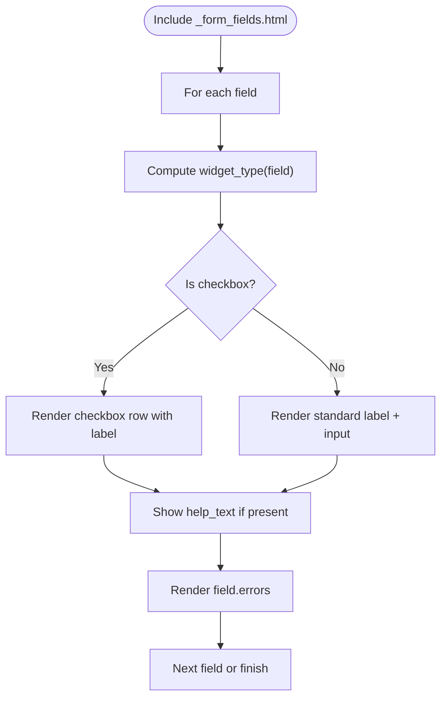
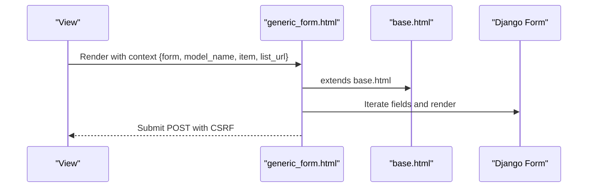
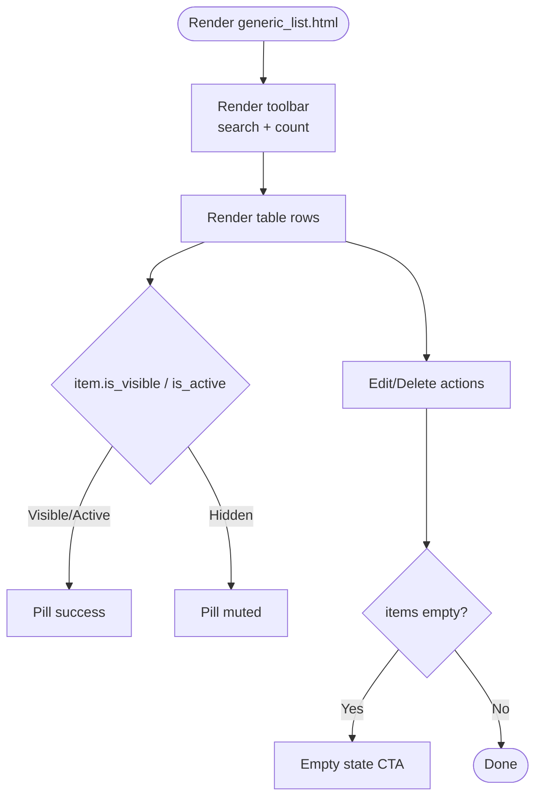
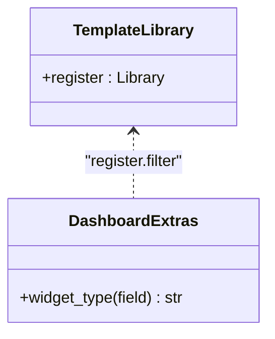
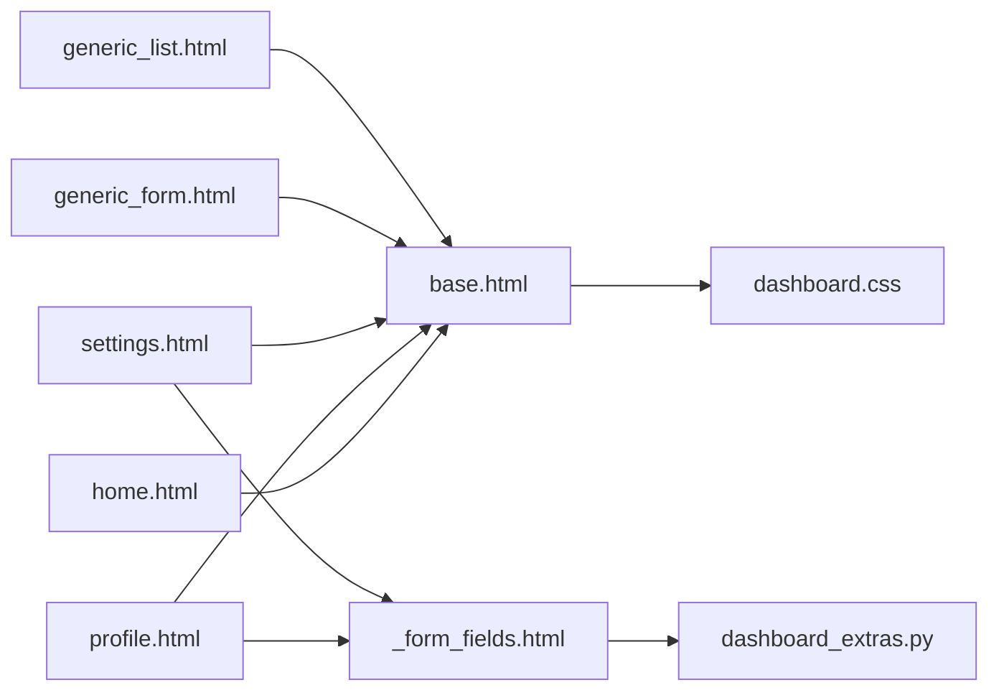

# Template System

<cite>
**Referenced Files in This Document**
- [base.html](file://templates/dashboard/base.html)
- [_form_fields.html](file://templates/dashboard/_form_fields.html)
- [generic_form.html](file://templates/dashboard/generic_form.html)
- [generic_list.html](file://templates/dashboard/generic_list.html)
- [home.html](file://templates/dashboard/home.html)
- [profile.html](file://templates/dashboard/profile.html)
- [settings.html](file://templates/dashboard/settings.html)
- [dashboard_extras.py](file://portfolio/templatetags/dashboard_extras.py)
- [dashboard.css](file://static/dashboard.css)
- [settings.py](file://core/settings.py)
</cite>

## Table of Contents
1. [Introduction](#introduction)
2. [Project Structure](#project-structure)
3. [Core Components](#core-components)
4. [Architecture Overview](#architecture-overview)
5. [Detailed Component Analysis](#detailed-component-analysis)
6. [Dependency Analysis](#dependency-analysis)
7. [Performance Considerations](#performance-considerations)
8. [Troubleshooting Guide](#troubleshooting-guide)
9. [Conclusion](#conclusion)

## Introduction
This document explains the Django template system architecture for the dashboard application. It covers:
- Base layout with sidebar, topbar, content area, and toast notifications
- Template inheritance and block usage
- Reusable form rendering and list display components
- Custom template tags
- CSS design system using custom properties, color schemes, responsive breakpoints, and theme switching
- Accessibility, cross-browser compatibility, and performance considerations

## Project Structure
The dashboard templates live under `templates/dashboard`. The base layout defines shared structure, while specific pages extend it. Forms and lists use reusable partials and generic templates. Styles are centralized in a single CSS file that implements a design system.

**Diagram sources**
- [base.html:1-188](file://templates/dashboard/base.html#L1-L188)
- [home.html:1-134](file://templates/dashboard/home.html#L1-L134)
- [profile.html:1-37](file://templates/dashboard/profile.html#L1-L37)
- [settings.html:1-31](file://templates/dashboard/settings.html#L1-L31)
- [generic_form.html:1-63](file://templates/dashboard/generic_form.html#L1-L63)
- [generic_list.html:1-81](file://templates/dashboard/generic_list.html#L1-L81)
- [_form_fields.html:1-25](file://templates/dashboard/_form_fields.html#L1-L25)
- [dashboard_extras.py:1-13](file://portfolio/templatetags/dashboard_extras.py#L1-L13)
- [dashboard.css:1-1304](file://static/dashboard.css#L1-L1304)

**Section sources**
- [base.html:1-188](file://templates/dashboard/base.html#L1-L188)
- [settings.py:57-72](file://core/settings.py#L57-L72)

## Core Components
- Base layout: Provides HTML shell, sidebar navigation, topbar, main content blocks, and global toasts.
- Form fields partial: Renders individual form fields consistently, including labels, help text, errors, and checkbox variants.
- Generic form template: A full-page form with header actions, grid layout, and footer buttons; supports add/edit flows.
- Generic list template: A table-based list view with toolbar, search input, status pills, and row actions.
- Custom template tag: Exposes a filter to determine widget type for conditional field rendering.

Key responsibilities:
- Layout and navigation: base.html
- Field rendering: _form_fields.html
- Full forms: generic_form.html
- Data tables: generic_list.html
- Widget detection: dashboard_extras.py

**Section sources**
- [base.html:27-166](file://templates/dashboard/base.html#L27-L166)
- [_form_fields.html:1-25](file://templates/dashboard/_form_fields.html#L1-L25)
- [generic_form.html:1-63](file://templates/dashboard/generic_form.html#L1-L63)
- [generic_list.html:1-81](file://templates/dashboard/generic_list.html#L1-L81)
- [dashboard_extras.py:1-13](file://portfolio/templatetags/dashboard_extras.py#L1-L13)

## Architecture Overview
The dashboard follows a layered template architecture:
- Base template defines structural blocks: title, page_title, page_subtitle, page_actions, content, extra_css, extra_js.
- Page templates extend base and fill these blocks.
- Shared UI patterns (forms, lists) are encapsulated in reusable templates.
- Styling is centralized in a design-system CSS file using CSS custom properties for theming and responsive behavior.

**Diagram sources**
- [base.html:1-188](file://templates/dashboard/base.html#L1-L188)
- [generic_form.html:1-63](file://templates/dashboard/generic_form.html#L1-L63)
- [_form_fields.html:1-25](file://templates/dashboard/_form_fields.html#L1-L25)
- [dashboard_extras.py:1-13](file://portfolio/templatetags/dashboard_extras.py#L1-L13)
- [dashboard.css:1-1304](file://static/dashboard.css#L1-L1304)

## Detailed Component Analysis

### Base Template: Layout Inheritance and Blocks
- Defines the root HTML document, language attribute, and theme attribute on the root element.
- Loads static assets via Django’s static tag and exposes extension points: extra_css and extra_js.
- Sidebar contains grouped navigation links with active-state logic based on current URL name.
- Topbar includes menu toggle, collapse toggle, quick jump search, site preview link, messages indicator, and theme toggle.
- Main content area provides blocks for page title, subtitle, actions, and body content.
- Toast container renders Django messages with icons and dismiss controls.

**Diagram sources**
- [base.html:1-188](file://templates/dashboard/base.html#L1-L188)

**Section sources**
- [base.html:1-188](file://templates/dashboard/base.html#L1-L188)

### Reusable Form Rendering: _form_fields.html
- Iterates over form fields and determines widget type using the custom filter.
- Applies full-width styling for textarea and checkbox inputs.
- Adds required indicators and error classes.
- Renders label, help text, and per-field errors.

**Diagram sources**
- [_form_fields.html:1-25](file://templates/dashboard/_form_fields.html#L1-L25)
- [dashboard_extras.py:1-13](file://portfolio/templatetags/dashboard_extras.py#L1-L13)

**Section sources**
- [_form_fields.html:1-25](file://templates/dashboard/_form_fields.html#L1-L25)
- [dashboard_extras.py:1-13](file://portfolio/templatetags/dashboard_extras.py#L1-L13)

### Generic Form Template: Add/Edit Flow
- Extends base and fills title, page_title, page_subtitle, and page_actions.
- Wraps form in a card with a two-column grid.
- Handles non-field errors and CSRF protection.
- Uses inline field iteration similar to the partial but embedded directly.
- Footer includes primary submit button and cancel/back action.

**Diagram sources**
- [generic_form.html:1-63](file://templates/dashboard/generic_form.html#L1-L63)
- [base.html:1-188](file://templates/dashboard/base.html#L1-L188)

**Section sources**
- [generic_form.html:1-63](file://templates/dashboard/generic_form.html#L1-L63)

### Generic List Template: Data Tables
- Extends base and fills title, page_title, page_subtitle, and page_actions.
- Provides a toolbar with search input and count summary.
- Renders a responsive table with columns for order, details, status, and actions.
- Displays status pills for visibility/activity and featured flags.
- Includes empty state with call-to-action.

**Diagram sources**
- [generic_list.html:1-81](file://templates/dashboard/generic_list.html#L1-L81)

**Section sources**
- [generic_list.html:1-81](file://templates/dashboard/generic_list.html#L1-L81)

### Home Dashboard Page
- Extends base and populates metrics cards with counters bound to data attributes.
- Shows module overview tiles and quick actions.
- Lists recent messages with unread indicators.

**Section sources**
- [home.html:1-134](file://templates/dashboard/home.html#L1-L134)

### Profile and Settings Pages
- Both extend base and include the reusable form fields partial.
- Provide dedicated headers and save actions.

**Section sources**
- [profile.html:1-37](file://templates/dashboard/profile.html#L1-L37)
- [settings.html:1-31](file://templates/dashboard/settings.html#L1-L31)

### Custom Template Tags
- Exposes a filter named widget_type that returns the lowercased widget class name for a given form field.
- Used to conditionally style or layout fields differently based on their underlying widget.

**Diagram sources**
- [dashboard_extras.py:1-13](file://portfolio/templatetags/dashboard_extras.py#L1-L13)

**Section sources**
- [dashboard_extras.py:1-13](file://portfolio/templatetags/dashboard_extras.py#L1-L13)

## Dependency Analysis
- Template dependencies:
  - home.html, profile.html, settings.html, generic_form.html, generic_list.html all extend base.html.
  - profile.html and settings.html include _form_fields.html.
  - generic_form.html uses the same pattern as _form_fields.html but is self-contained.
  - _form_fields.html depends on dashboard_extras.py for the widget_type filter.
- Static asset dependencies:
  - base.html loads dashboard.css and dashboard.js.
  - All templates inherit styles from dashboard.css.
- Context variables:
  - request.user, request.resolver_match.url_name used in base.html for navigation and user info.
  - unread_count used in base.html for badges.
  - model_name, items, has_order used in generic_list.html.
  - form, item, list_url used in generic_form.html.
  - modules, recent_messages, and metric counts used in home.html.

**Diagram sources**
- [base.html:1-188](file://templates/dashboard/base.html#L1-L188)
- [home.html:1-134](file://templates/dashboard/home.html#L1-L134)
- [profile.html:1-37](file://templates/dashboard/profile.html#L1-L37)
- [settings.html:1-31](file://templates/dashboard/settings.html#L1-L31)
- [generic_form.html:1-63](file://templates/dashboard/generic_form.html#L1-L63)
- [generic_list.html:1-81](file://templates/dashboard/generic_list.html#L1-L81)
- [_form_fields.html:1-25](file://templates/dashboard/_form_fields.html#L1-L25)
- [dashboard_extras.py:1-13](file://portfolio/templatetags/dashboard_extras.py#L1-L13)
- [dashboard.css:1-1304](file://static/dashboard.css#L1-L1304)

**Section sources**
- [base.html:37-121](file://templates/dashboard/base.html#L37-L121)
- [generic_list.html:13-79](file://templates/dashboard/generic_list.html#L13-L79)
- [generic_form.html:14-60](file://templates/dashboard/generic_form.html#L14-L60)
- [home.html:16-133](file://templates/dashboard/home.html#L16-L133)

## Performance Considerations
- Preconnect to external fonts and icon CDN to reduce font loading latency.
- Use CSS custom properties for theme switching to avoid reflows and repaints.
- Keep CSS in a single optimized file; consider minification and caching in production.
- Avoid heavy animations on low-power devices by respecting reduced motion preferences.
- Defer or async-load non-critical JavaScript where possible.
- Use semantic HTML and minimal DOM depth to improve rendering performance.
- Prefer server-side rendering of static lists; client-side search should be lightweight.

[No sources needed since this section provides general guidance]

## Troubleshooting Guide
- Missing context variables:
  - Ensure views pass required variables like model_name, items, form, unread_count, and modules.
- Form validation not showing:
  - Verify that forms include CSRF token and that non_field_errors are rendered.
- Navigation active state incorrect:
  - Check that url names match those used in base.html navigation groups.
- Theme not persisting:
  - Confirm localStorage is available and that the script runs before first paint.
- Styles not applied:
  - Ensure STATIC_URL and STATICFILES_DIRS are configured correctly and static files are collected in production.

**Section sources**
- [base.html:8-16](file://templates/dashboard/base.html#L8-L16)
- [generic_form.html:24-26](file://templates/dashboard/generic_form.html#L24-L26)
- [settings.py:91-94](file://core/settings.py#L91-L94)

## Conclusion
The dashboard template system is built around a strong base layout with clear extension points, reusable form and list components, and a cohesive CSS design system. Custom template tags enable flexible field rendering, while CSS custom properties provide a robust theme mechanism. Following the patterns documented here will ensure consistent, accessible, and performant templates across the application.

[No sources needed since this section summarizes without analyzing specific files]